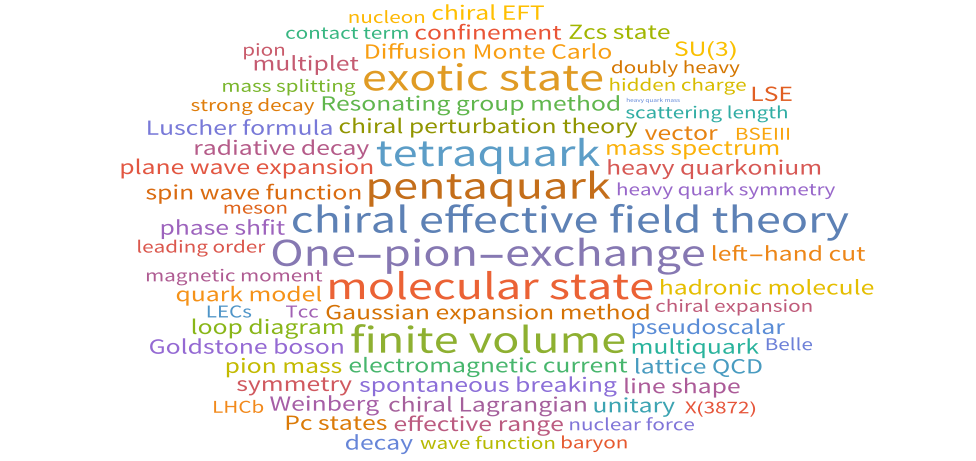

## 招贤纳士 (每年) 📢
* 1-2名博士或者硕士研究生
* 1-2名博士后
* 无论你是擅长理论推导、模型构建还是数值计算，都可以找到有**趣的课题**，获得**有力的支持**
* 如果你什么都不擅长，但是依旧对于科研抱有**兴趣**，也欢迎你来碰碰运气！

## 办公地址 :office:
东南大学九龙湖校区田家炳楼北114

<!--  -->
## 研究兴趣 🧐

强子物理理论，强子谱学，强子相互作用，有效场论和格点QCD

## 个人简介👤

<!-- 孟璐，东南大学研究员，国家级青年人才项目（海外）入选者，山东人，生于1992年。 -->
孟璐，东南大学教授，青年首席教授，山东人，生于1992年。

自博士起一直从事强子物理的研究，重点关注奇特强子态，如四夸克态和五夸克态，致力于揭示这些奇特态出现的模式以加深对于量子色动力学（QCD）非微扰性质的理解，如手征对称性自发破缺和色禁闭。尽管从事理论研究，但我注重结合最新的实验结果（来自北京正负电子对撞机或欧洲核子中心的大型强子对撞机等）以及格点QCD（在离散时空点上求解QCD的数值方法）的进展。近年来，我也开始应用一些深度学习的方法（AI4Science）。 

## 论文发表 📑

[完整论文列表](https://inspirehep.net/authors/1692520)

## 工作经历 👨🏻‍💻
* **2025/12 – 现在** 东南大学，教授，青年首席教授
  
* **2025/07 – 2025/12** 东南大学，副研究员

* **2020/10 – 2025/06** 波鸿鲁尔大学，博士后 (合作导师: [E. Epelbaum](https://www.physik.ruhr-uni-bochum.de/en/Professuren/prof-dr-epelbaum-evgeny/))

## 教育背景 🎓
* **2015/09 – 2020/06** 北京大学，博士 (导师: [朱世琳](https://faculty.pku.edu.cn/zhushilin/zh_CN/index.htm))

* **2011/09 – 2015/06** 山东大学，本科

## 荣誉 🏆
<!-- * **2025/12** 国家级青年人才项目（海外） -->
* **2025/12** "Chinese Physics C" Outstanding Reviewer Awards
* **2015/10** 北京大学优秀博士论文

## 同行评议 ⚖️
* APS系列: `Phys.Rev.Lett.`, `Phys.Rev.D`
* 中国杂志: `Sci.Bull`,  `Chin.Phys.C`, `Chin.Phys.Lett.`, `Commun.Theor.Phys.`, `Chin.J.Phys.`
* 其它: `Phys.Lett.B`, `JHEP`,  `EPJC`, `EPJA`,  `Nucl.Phy.B`,  `Nucl.Phy.A`